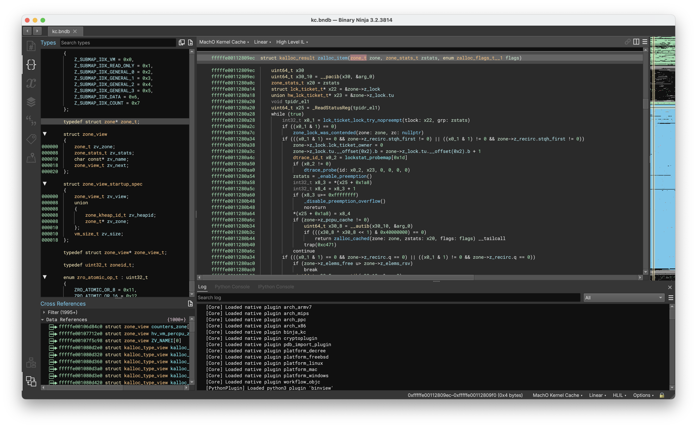

# BinjaKC

A plugin for loading Mach-O kernelcache and dSYM files into Binary Ninja.



This plugin can load symbols and type information from multiple dSYM files contained in the KDK to the corresponding kernelcache opened in Binary Ninja. It will automatically handle sliding of symbol address, merging of duplicate types and renaming of different types with same name. It can also import function and data symbol names from Mach-O kernel extensions contained in the KDK to the corresponding kernelcache.

## Installation

### Prerequisites

#### Setup Binary Ninja API

1. Clone the Binary Ninja API repository along with its submodules

```bash
git clone --recursive https://github.com/Vector35/binaryninja-api.git
```

2. Set the environment variable `BN_API_PATH` to the path of directory containing the cloned Binary Ninja API source code 

```bash
export BN_API_PATH="$PWD/binaryninja-api"
```

3. If the Binary Ninja app is in a non-standard installation location (`/Applications` for macOS), set the environment variable `BN_INSTALL_DIR` to path of the Binary Ninja installation

```bash
export BN_INSTALL_DIR="<path-to-binary-ninja-application>"
```

4. If you are using the stable version of Binary Ninja app, checkout the `master` branch of the Binary Ninja API repository

```bash
pushd "$BN_API_PATH"
git checkout master
popd
```

### Building and installation

1. Clone the BinjaKC repository along with its submodules

```bash
git clone --recursive https://github.com/skr0x1c0/binja_kc
```

2. Use `cmake` to build the plugin

```bash
cd binja_kc
mkdir build
cd build
cmake .. -DCMAKE_BUILD_TYPE=RelWithDebInfo
make -j$(nproc) install_binja_kc
```

If everything goes well, the plugin will be installed on the plugins folder in the Binary Ninja user directory. You can verify this by opening the Binary Ninja application. The message `[Core] Loaded native plugin binja_kc` will be displayed on the log.

## Usage

### For loading kernelcache with symbols from KDK

NOTE: The kernelcache should be a Mach-O file

1. Place the kernelcache in a directory of your choice

```bash
mkdir kc
cd kc
cp /private/var/db/KernelExtensionManagement/KernelCollections/BootKernelCollection.kc ./kernelcache
```

2. Copy the respective KDK to the same directory with name `<name-of-kernel-cache>.symbols`

```bash
cp -R /Library/Developer/KDKs/KDK_13.0_22A5331f.kdk ./kernelcache.symbols
```

3. Now you can directly open the kernelcache in Binary Ninja application. The symbols and type information from the KDK will be loaded automatically.

### For loading normal Mach-O files with symbols from dSYM

Place the dSYM file in the same directory as that of Mach-O binary with name `<name-of-binary>.dSYM` and open the binary as usual using Binary Ninja application. The symbols and type information will be automatically loaded.

## License

This project is licensed under the MIT License - see the [LICENSE](LICENSE) file for details
